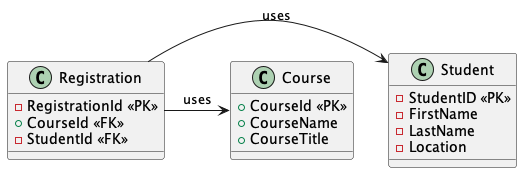
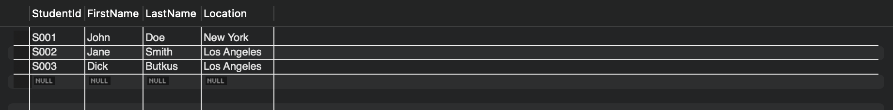
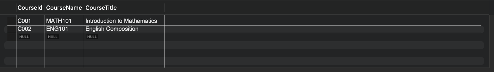
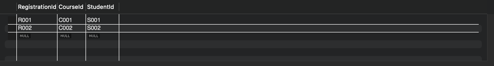
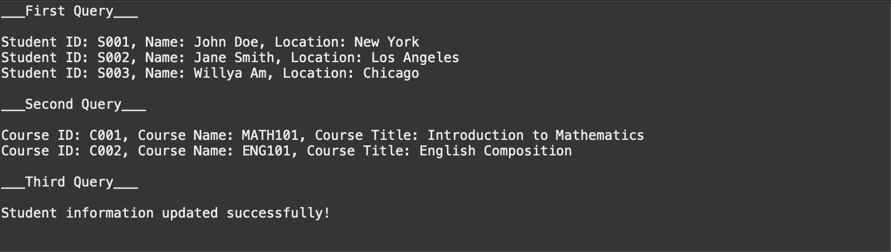

##ER Diagram for Student Registration System

#ER Diagram
	
	Notation:
	
	<<PK>> - Primary Key
	<<FK>> - Foreign Key
	

#Database and JDBC Install

	Screenshots of Tables in the Database StudentSys:
	

	Steps:
	
	1. Downloading the JDBC zip file from MySQL and then making a lib folder in the project. 
	2. Adding the JDBC to the classpath for the project folder.
	 
	Screenshot of JDBC Install:
	

#Output

	The output of sample code used to complete the exercise: 
	

#Code for ER Diagram

	@startuml
	Class Student {
	- StudentID <<PK>>
	- FirstName
	- LastName
	- Location
	}
	
	Class Course {
	+ CourseId <<PK>>
	+ CourseName
	+ CourseTitle
	}
	
	Class Registration {
	- RegistrationId <<PK>>
	+ CourseId <<FK>>
	- StudentId <<FK>>
	}
	
	Registration -> Student: uses
	Registration -> Course: uses
	@enduml